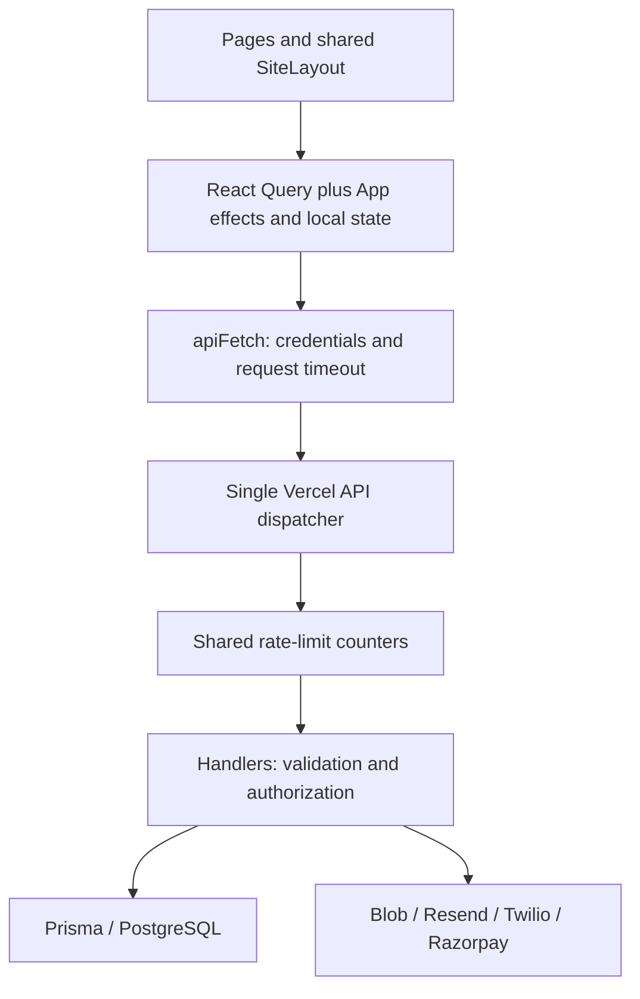

# Architecture, security and UI/UX audit

Reviewed: 2026-09-12. This is the consolidated source audit and target design standard for the current application. Implementation status stays in [PROJECT_STATUS.md](PROJECT_STATUS.md); [APPLICATION_BACKLOG.md](APPLICATION_BACKLOG.md) remains the only completion checklist. The standards below are requirements for remediation, not claims that the application already follows them.

## Outcome and scope

The current React/Vite, React Query, Prisma/PostgreSQL and single Vercel dispatcher architecture can support this application. A framework rewrite is not needed to address the reported experience. The immediate priorities are customer isolation and session correctness, truthful API feedback, then a shared layout/component system applied to every page. Retain the approved light Ink and Citron identity.

The reported waiting is not simply the time needed to calculate a count. Cart totals are small local reductions. Source evidence shows independent copies of server state, serialized requests, inconsistent pending controls, sequential startup reads, provider work inside requests, and failures disguised as empty content. Actual network/database/cold-start timings were not measured; these are code findings and likely contributors, not a production performance diagnosis.

Read all 14 repository-owned Markdown files, including the hidden Copilot instructions and historical documents. Reviewed all 13 page source files, the router, shared layout/buttons/notifications/filter/grid components, global CSS, App state, HTTP/query/storefront/wishlist modules, deployment configuration and selected security/commerce handlers. Dependency/vendor/generated Markdown under node_modules, dist, .git and .vercel is outside the documentation review.

Browser inspection was attempted using the installed browser skill. Its connection failed before navigation because the tool rejected missing sandbox metadata (`sandboxPolicy`). No current screenshots, computed browser layouts, authenticated clicks, request timings, accessibility tree or production headers were verified. Earlier user screenshots explain the complaint but do not prove the current revision's appearance. No customer records or provider operations were exercised.

## E13 stock/cancellation remediation

The stock/cancellation portion of SEC-03 now uses one Serializable order transaction, active-stock conditional decrement, all-or-nothing cart consumption, guarded shared customer/admin cancellation and one-time restock. Closed orders cannot be reopened by admin status edits; late payment captures only confirm pending orders. Safe 409 conflicts require refresh instead of automatic write replay. New transaction/provider-state regressions bring the offline suite to 56 passing tests.

This does not complete SEC-03: actual provider refunds/reconciliation, payment replay/event ordering, approved fulfillment/return eligibility and production concurrency acceptance remain. The owner explicitly handles production validation; Codex must not inspect .env or run live environment/API/database checks. Use the offline build and synthetic tests for continuing implementation. Original findings below remain historical rationale where superseded by E11-E13.

## Remediation update - E11/E12

The findings below preserve the original audit rationale. E11 now implements SEC-01 address validation/legacy relation hiding; SEC-02 account/generation private keys, awaited logout, stale transport/body guards, memory-only wishlist and cross-tab invalidation; and the no-store-error portion of SEC-04. Remaining CSRF, stock/payment/refund, broad isolation and production security gates are still open. Signup already selected limited identity fields; E11 adds the selected role and aligns its response shape.

UX-01/02 now use parallel public startup and shared header/cart coordination. UX-03 handles pending/errors and owned ID/number lookup. UX-04 has explicit section states and sequential upload progress/reuse, but full panel refactoring/entity-specific admin operations remain. UX-05 debounces/cancels search and consumes cursor pages. UX-06 removes generated reviews, revalidates products and uses a compact loader. Auth no longer collects an unused address; durable provider notifications remain open.

PageContainer and shared spacing/touch/focus/mobile foundation now apply across the route map. This is an initial implementation of the design standard, not full page-by-page rendered acceptance. Browser setup remains blocked; Android/iOS testing was not performed. E11 records 38 passing synthetic tests and live temporary-table SQL verification; all three migrations are already applied on the configured database. E12 fixes and verifies local Vercel routing while retaining one dispatcher. See current status for exact evidence and remaining limits; the original observations below are superseded where described here.

## Architecture assessment

### Readability follow-up — 2026-09-12

The source has now been mechanically formatted with pinned Prettier 3.9.6; compressed TSX/TS/JS and CSS blocks are expanded consistently. Shared .prettierrc.json, .prettierignore and .editorconfig plus npm run format / format:check establish the ongoing workflow. This changes source presentation, not the proposed layout design or audited application behavior. Status evidence E10 records passing formatting/debug checks, 20 tests, build/types, lint with eight existing warnings and a fresh npm audit with zero known advisories.

Structural cleanup remains required: break AdminPage/ProductDetailPage into focused components and domain hooks, replace loose any types with actual API contracts, remove duplicated state and obsolete CSS at its source, and address React warnings with targeted regression evidence. Keep these changes incremental so authorization, mutations, routing and mobile layout remain reviewable. Do not label the architecture clean merely because the formatter passes.

Keep `api/[...route].ts` as the only deployment entry point. Keep implementations under `server/api`. Preserve existing URLs, cookie forwarding and SPA rewrites; earlier deployment and CSP fixes are regression constraints. A custom History API router is currently used; React Router is not installed.

Target boundaries, introduced incrementally:

| Layer | Responsibility and rule |
| --- | --- |
| App/bootstrap | Public configuration and session readiness; no duplicated cart/admin data ownership. Public navigation can render while session-dependent controls reserve space; protected content must wait for verified identity. |
| Session owner | Verified user ID/role, loading/error/guest/authenticated states, expiry, logout, account switch and cross-tab invalidation. A network outage must not masquerade as a confirmed logout. |
| Domain query hooks | Shared key factories, response types, cancellation and mutation/invalidation policies. Header and cart page consume the same cart resource. Use React Query already installed. |
| Local component state | Draft form fields, open dialogs, selection and transient view state. Do not maintain a second authoritative copy of server entities. |
| HTTP boundary | Credentials, bounded requests, typed safe errors, private-request handling, cancellation and request ID propagation. Do not automatically retry non-idempotent writes. |
| Dispatcher/handlers | Route/method validation, abuse controls, server authentication and record ownership. Client roles and hidden buttons are never authorization. |
| Commerce services | Transactional stock/order transitions, server-calculated amounts, idempotency and provider reconciliation. Extract reusable logic as these handlers are repaired. |
| Data/configuration | Editable business content in configuration/database; secrets server-only. No multi-tenant expansion or extra serverless functions as part of this cleanup. |
| Notification delivery | Durable queued events with retries for email and operational notifications, once implemented. Subscription/payment persistence and provider delivery need distinct outcomes. |

Suggested future locations are `src/features/<domain>/` for hooks/contracts and `src/components/ui/` for shared controls. These folders/components are proposals, not existing implementation. Avoid a bulk relocation; extract while repairing each domain and preserve import/route tests.

## Security-first findings

Priorities: P0 blocks release or risks customer/money integrity; P1 blocks reliable daily use; P2 improves maintainability and presentation. Findings are source-confirmed unless labelled as a verification gap; none is a claim of a demonstrated production exploit.

| ID / priority | Evidence and impact | Required remediation and acceptance |
| --- | --- | --- |
| SEC-01 / P0 | [Order creation](server/api/orders/index.ts) assigns submitted addressId to shippingAddressId without looking up ownership. [Order detail](server/api/orders/[id].ts) includes that linked address. A valid foreign address reference could link another customer's data. | Validate the address belongs to the authenticated user before creating an order; reject foreign/missing IDs without returning address details. Test two customers, absent address, unknown ID and no partial writes. |
| SEC-02 / P0 | [App](src/App.tsx) retains only authentication/role flags. Cart, own-review, tracking and admin keys omit user ID. Logout starts an unawaited request and immediately clears UI/cache; older requests can still resolve. Wishlist IDs use unscoped localStorage and unchecked JSON.parse. | Verified identity plus session generation; private keys include user ID; cancel/discard older reads and mutations; clear private cache, optimistic state and copied page data on identity change. Await server logout and provide retry on failure. Never persist credentials/customer payloads in localStorage. Verify A → logout → B with delayed A responses and multiple tabs. |
| SEC-03 / P0 | Order stock checks happen before the transaction and decrement without a conditional stock guard. Cancellation checks state before a later unconditional update/restock. [Admin refund](server/api/admin/payments.ts) sets REFUNDED in the database without a provider refund. | Atomic eligibility/stock/state transitions, idempotency and authoritative payment/refund reconciliation. Test concurrent orders/cancellations, duplicate callbacks and repeated refunds. Keep unverified purchase/refund actions unavailable to customers/operators. |
| SEC-04 / P0 | Original audit found cache/error/CSRF gaps. E11 adds no-store errors, E14 adds central CSRF/source checks, and E15 adds the runtime dispatcher exception boundary and consistent error details. Full production/session/security acceptance remains open. | Default errors/auth/private responses to no-store; allow public caching only for successful public DTOs. Review unsafe methods, Origin/Fetch Metadata or CSRF tokens as appropriate, preserving signed webhook behavior. Test cookies, cross-origin rejection, expired sessions and malformed routes. |
| SEC-05 / P0 verification gap | Rate limiting and upload validation exist, but counter migration/live evidence remains pending; no active CSP is configured. Public Blob uploads and HTTP(S) URL validation do not establish private-file access or full content safety. | Follow [RATE_LIMITING.md](RATE_LIMITING.md); verify live 429/recovery and safe 503s. Review media ownership, allowed storage origins, size/count/body limits and orphan cleanup. Roll out CSP with separate development/production checks for Vite, media and providers before enforcement. |
| SEC-06 / P0 verification gap | Fresh dependency/advisory review, penetration tests, production bundle/network review, provider replay checks and security regression coverage are not supplied by existing tests. | Complete the existing release gates with redacted evidence. Public API URLs and shipped JavaScript are normally visible in Network; protect secrets and customer data through server authorization and minimal responses, not by attempting to hide routes. |

Use [OWASP Authorization guidance](https://cheatsheetseries.owasp.org/cheatsheets/Authorization_Cheat_Sheet.html) for per-request ownership review and [OWASP Session Management guidance](https://cheatsheetseries.owasp.org/cheatsheets/Session_Management_Cheat_Sheet.html) for session lifecycle and storage decisions. Authentication existing is not evidence that all authorization paths are safe.

## Why clicks feel slow or unreliable

| ID / priority | Source finding | Required interaction/data change |
| --- | --- | --- |
| UX-01 / P1 | [App](src/App.tsx) explicitly refetches storefront on mount as well as subscribing to its query. The [adapter](src/api/storefront.ts) awaits categories then products and catches failures into empty data. Header cart/wishlist reads are separate effects; admin analytics is requested just to infer role. | One owner per resource, parallel independent startup reads, error states distinct from empty results, verified role from session, shared header/page queries. Measure request counts; do not claim every effect necessarily produces another completed request because query deduplication can apply. |
| UX-02 / P1 | [CartPage](src/pages/CartPage.tsx) waits for PATCH/DELETE and disables every row using one updating flag. App add-to-cart already increments the header optimistically but serializes all additions and performs a reconciliation GET. | Use one cart mutation coordinator for add/change/remove across surfaces. Update affected quantity/count/estimated total immediately, serialize or coalesce safely, roll back only the failed operation, and reconcile authoritative data. Lock only conflicting controls; disable checkout while the cart is unresolved. |
| UX-03 / P1 | [TrackOrderPage](src/pages/TrackOrderPage.tsx) has no pending button state. refetch can resolve with result.error, so its catch misses failures other than the manually checked 404. | Explicit pending/error result handling, synchronous duplicate guard, scoped query, matching order-number/ID contract and retryable state. Never leave an old result looking like the newest lookup. |
| UX-04 / P1 | [AdminPage](src/pages/AdminPage.tsx) swallows read errors, displays default zeros/empty tables and disables its navigation while busy. Uploads use unbounded Promise.all and a generic uploading/saving label. | Section-specific loading/error/retry and entity-level pending state. Bound upload concurrency, show file/stage progress, retain completed uploads across retries, and protect unsaved drafts when leaving. Refactor the large component into domain panels. |
| UX-05 / P1 | [ShopPage](src/pages/ShopPage.tsx) queries each search change without debounce or consuming AbortSignal. getProducts returns empty results on HTTP failure; nextCursor is never consumed. The virtualized grid measures the first card and uses window scroll/layout reads. | Start with a 300ms search debounce, cancel superseded reads, distinguish empty/error and consume cursor pages. Profile the grid at actual container widths and long content before changing virtualization. Reserve media dimensions and lazy-load noncritical images. |
| UX-06 / P1 | [ProductDetailPage](src/pages/ProductDetailPage.tsx) requests own-review even for guests, prefers the initial catalog record without revalidation, renders a large loading heading, and substitutes generated reviews when server data is empty. | Scope own-review to verified identity; revalidate detail data; show a layout-shaped skeleton, authentic empty/error feedback and truthful moderation state. Keep the existing own-review pencil and submission lock. |
| UX-07 / P1 | Review uploads are serial, then one review save; four selected files legitimately mean four uploads plus one save. [Newsletter](server/api/newsletter/subscribe.ts) may await contact creation, DB write and email delivery sequentially. | Distinguish expected file requests from duplicate submissions. Show “Uploading 2 of 4” then “Saving review”; retry failed stages without duplicating completed work. Separate subscription saved/email accepted/delivery unknown; use a durable outbox before returning early for mail work. |
| UX-08 / P1 | [AuthPage](src/pages/AuthPage.tsx) asks for a required signup address but does not include it in payload; login/signup errors become generic. [Orders](src/pages/OrdersPage.tsx), [order details](src/pages/OrderDetailPage.tsx) and [checkout](src/pages/PaymentPage.tsx) are empty/placeholder flows. | Do not collect unused fields. Map safe validation/auth errors, preserve failed drafts, and connect truthful commerce data before presenting completed orders/payments/delivery promises. |

### Shared action contract

The timeout is a failure boundary, not a target wait. Keep 30 seconds for normal requests and 60 seconds for explicit long-running calls. A multi-step upload workflow can take longer than one request; show stages and document its total budget. Client cancellation cannot undo a server commit.

| Action | Immediate feedback | Completion and failure |
| --- | --- | --- |
| Navigation/filter | Navigate locally or update filter selection immediately; preserve content with a small refresh indicator. Skeleton only when no usable content exists. | Latest result wins; show section retry for failures. Do not blank the whole application for a background read. |
| Cart/wishlist | Optimistic count/heart/quantity plus pending indication; block conflicting duplicate writes. | Reconcile server result, roll back only failed work. No extra success snackbar when the state already confirms success. |
| Login/signup/logout | Stable button label area with busy text/icon; keep unrelated public navigation responsive. | Confirm server session result before claiming success; clear private data at boundaries and preserve inputs on failure. |
| Product/review/category save | Immediate “Saving…” or per-file progress; synchronous lock and accessible busy state. | Update list/detail from the server response, invalidate affected public/private queries, reset successful creation forms. Preserve failed drafts and media selection. |
| Payment/order/refund | Processing state with duplicate protection; never optimistic financial success. | Server-verified outcome with idempotency/reconciliation. On timeout show unknown outcome and a status-check path before allowing another attempt. |
| Newsletter/support | Busy state local to form; confirm the actual persisted operation. | Five-second snackbar; ticket/subscription state remains visible. Provider acceptance does not prove recipient delivery. |

Target visible acknowledgement in the next render, normally within 100ms on the test device; measure it rather than adding artificial sleeps. After several seconds use specific ongoing-work copy, without invented completion estimates or percentages. Preserve button dimensions, keyboard focus and surrounding layout. Do not merely re-enable a button while the original non-idempotent write is still running.

Use [TanStack Query cancellation](https://tanstack.com/query/latest/docs/framework/react/guides/query-cancellation) by consuming query signals. Shared mutation hooks should cancel relevant reads, record the optimistic delta, apply it, reconcile success or roll back failure, then invalidate the affected keys. Keep private state scoped by verified account and session generation throughout this sequence.

## One layout and design standard

### Mobile is the primary experience

The owner confirms that most customers use mobile. Design and verify phone layouts first, then enhance the same components for tablet and desktop. Responsive work is a P1 acceptance requirement for every customer flow, not a final cosmetic pass. Security remains P0. Admin must also work on phones without exposing extra data or actions.

| Mobile area | Required behavior and acceptance |
| --- | --- |
| Viewports | Check 320, 360, 375, 390, 414 and 430 CSS pixels, portrait and landscape; then 768, 1024, 1440 and 1920px. Use available container space rather than device names to choose layout changes. |
| Navigation | Compact header with reachable search/cart/account controls; accessible menu for remaining routes. Orders/Admin remain discoverable for the appropriate role. Menu closes on selection/Escape, restores focus and does not cover the active form. |
| Catalog and filters | Keep product names, prices and actions readable; use one column when two no longer fit. Mobile filters use an accessible collapsible panel or sheet with visible selection count and clear/apply behavior. Preserve selection and scroll position when returning from a product. |
| Touch and forms | At least 44×44px project touch targets, 48px primary actions, space between destructive and ordinary actions, no hover-only controls. Use 16px input text, appropriate input types/inputMode and autocomplete. Support paste/password managers and do not disable zoom. |
| Keyboard and viewport | With the software keyboard open, the focused field, validation and submit action remain reachable by scrolling. Test browser chrome expansion/collapse, safe-area insets and rotation; fixed heights must not crop content. |
| Actions and overlays | Immediate local pending feedback; unrelated controls remain responsive on slow connections. Social links move into the footer on phones. Any sticky purchase bar, snackbar, menu, dialog and back-to-top control must have reserved space and never overlap another action or the keyboard. |
| Media and network | Responsive image sizes, reserved aspect ratios, lazy noncritical images and no automatic video download/playback. Show per-file upload progress/stages and preserve drafts after failure. Measure on a representative lower-powered Android device and throttled network, not desktop emulation alone. |
| Connectivity | Offline/reconnected feedback and recoverable reads; no automatic replay of purchases or other non-idempotent writes. Keep sensitive drafts/cache in memory and preserve the session/customer isolation requirements. |
| Accessibility | Test touch, keyboard and screen reader navigation, text enlargement, contrast and reduced motion. Swipe may supplement visible gallery/carousel controls but cannot be the only way to operate them. |
| Admin | Stack forms, keep row actions labelled, and use readable cards or a labelled local table scroll area. The entire page must not scroll sideways. Preserve edits during section changes and uploads. |

Mobile release evidence must include Android Chrome and iOS Safari on real devices when available, plus responsive emulation. Record unavailable devices as an acceptance gap. Check every page's loading, empty, error, success and slow-request state; desktop success does not establish mobile completion.

There is no universal ecommerce color or width. The following are project design choices that standardize the existing brand; accessibility requirements are identified separately. This is the target specification for the shared-layout implementation, not a description of current CSS.

### Existing layout problems

[App.css](src/App.css) contains starter styles, repeated component selectors, many arbitrary spacing values and late specificity overrides. Early page widths range from 620px to 1280px, but the later shared selector overrides most to 1440px; product detail/reviews use 1120px and auth retains a 556px inner card. Therefore simply changing an early max-width often has no visible effect. Vertical page padding still varies from roughly 52px to 130px.

`.page-section` enforces 620px minimum height even on short home sections. `.state-message` reserves a full viewport even inside a page, and product loading uses an h1. These produce unnecessary empty space. The header becomes fixed after a scroll threshold without a dedicated reserved slot. The social rail, back-to-top, drawers and snackbar use unrelated positioning/layer values. These are overlap/layout-shift risks to verify in the browser, not measured CLS findings.

### Layout tokens and components

| Token / component | Standard for migration |
| --- | --- |
| Outer container | `--layout-max: 1440px`; centered, width 100%, border-box. Header, footer and main share outer gutters. |
| Responsive gutter | `--page-gutter: 20px` below 768px, 32px at 768–1199px, 48px at 1200px+. Avoid a second gutter on nested children. |
| Width variants | Shared PageContainer: wide 1440px for catalog/admin/home, content 1120px for cart/orders/detail/checkout, reading 760px for policy/support/tracking, form 560px for auth. These are intentional inner variants in one layout, not separate page systems. |
| Vertical rhythm | Page top/bottom 48px desktop and 32px mobile. Section spacing 48px desktop and 32px mobile. Header-to-content and title-to-content spacing follow tokens; promotional hero can use a documented 64px variant. |
| Spacing scale | 4, 8, 12, 16, 24, 32, 48, 64px. Field label gap 8px; form fields 16px; card padding 24px desktop/16px mobile; action gap 12px; section heading bottom 24px. |
| Shared shell | One SiteLayout with header/main/footer and a skip link. Main flexes to fill available viewport space; content sections have no blanket minimum height. Handle sticky header height without a jump. |
| PageHeader / PageSection | Shared heading, optional description/actions and consistent margins. One page h1; subordinate sections use h2. Preserve width during skeleton/error/empty states. |
| Shared controls | Button, IconButton, FormField, Input, Select, Textarea, Card, Skeleton, EmptyState, ErrorState and Dialog primitives. Existing AddToCartButton delegates visual/pending behavior to Button while retaining cart semantics. |
| Responsive grid | Fit readable cards to the actual container; 1 column at very narrow widths, 2 mobile where cards fit, 3 medium and 4 wide where space allows. With a filter/sidebar, use available content width, not viewport width alone. Keep grid-only catalog. |
| Radii | 4px controls, 8px cards/dialogs, full radius only for badges/circular icon controls. Existing brand style stays recognizable. |
| Layering | Central tokens: base 0, sticky 100, popover 200, floating utility 300, modal 1000, notification 1100. Manage focus/inert background for dialogs; z-index alone does not solve overlap or keyboard access. |

Prefer footer social links on narrow screens and transactional/admin pages; only display configured destinations. Any desktop rail must occupy reserved space outside readable content. Snackbars must respect safe areas and cannot obscure checkout actions. Dialogs must trap/restore focus, close appropriately with Escape, and prevent interaction with background content. Honor reduced-motion preferences for shimmer, pulse, hover rotation, smooth scroll and transitions.

### Color and typography

Measured below using WCAG relative luminance of solid CSS token pairs, rounded to two decimals. These are mathematical token checks, not a whole-page accessibility certification; opacity, imagery, focus backgrounds and business overrides need rendered verification.

| Pair | Ratio | Decision |
| --- | --- | --- |
| Primary Ink #28313b on paper #f5f1e9 | 11.70:1 | Suitable for normal text/icons and focus on light backgrounds. |
| Muted #687067 on paper | 4.54:1 | Barely meets normal-text AA at full opacity; do not fade it further. |
| Citron #c7d866 on paper | 1.39:1 | Decorative accent only here; unsuitable for essential text or distinguishing the current focus outline. |
| Surface #fffdf8 on Citron | 1.54:1 | Do not use light text on Citron. |
| Primary Ink on Citron | 8.44:1 | Suitable for accent badges/buttons. |
| Border #d8d5cc against surface | 1.44:1 | Decorative divider only; insufficient if it is the sole visual boundary identifying an input. |

Preserve primary #28313b, accent #c7d866, paper #f5f1e9 and surface #fffdf8. Introduce semantic aliases for primary text, muted text, control border, focus, danger, success and warning rather than raw page-specific colors. Use Ink focus rings on light surfaces and a contrasting light ring on dark surfaces. Pair status colors with text/icons. Product swatches use stored hex values and readable names; selected state must not rely on color alone.

Typography target: keep Georgia for editorial/page headings and Arial/system sans-serif for controls/body UI. Body and input text 16px, normal line-height 1.5; labels/buttons 14px; supporting metadata at least 12px as a project preference. Page h1 32–48px responsive; h2 24–32px; card titles 18–20px. Reserve 48–64px display text for the home hero. Reading content should stay about 65 characters wide. Use sentence case for ordinary labels instead of widespread small uppercase text. Currency/status/validation must use the existing localization layer.

Accessibility target: WCAG 2.2 AA. Normal text contrast at least 4.5:1, large text 3:1; identifying controls and states need appropriate non-text contrast. [WCAG contrast guidance](https://www.w3.org/WAI/WCAG22/Understanding/contrast-minimum) explains the text thresholds; [WCAG 2.2](https://www.w3.org/TR/WCAG22/) covers non-text contrast and focus.

Project control target is 44×44px minimum (48px for primary form actions), with at least 8px separation where useful. This is deliberately larger than the WCAG 2.2 AA 24×24px minimum, which has defined exceptions; do not incorrectly report every existing 30–40px control as an automatic AA failure. See [target size](https://www.w3.org/WAI/WCAG22/Understanding/target-size-minimum.html). At 320 CSS pixels and at zoom, content must reflow without whole-page horizontal scrolling; genuine data tables can have a labelled local scroll region. See [reflow](https://www.w3.org/WAI/WCAG22/Understanding/reflow.html).

## Page-by-page migration coverage

This table specifies the work. [PAGE_INVENTORY.md](PAGE_INVENTORY.md) remains authoritative for current routes/access. Apply shared components first, then inspect each route and all its states; matching class names is not proof of matching UI.

| Page / route | Layout and interaction acceptance |
| --- | --- |
| Home / | Wide container, intentional hero variant, natural-height sections, accurate configured copy, section-level loading/error and responsive newsletter. |
| Products /products | Wide container, readable grid/sidebar, checkbox rating semantics agreed with API, DB hex color swatches, debounce, pagination, empty/error distinction and keyboard product links. |
| Product /product/:id | Content container shared with reviews; stable gallery skeleton, actual description, stale-detail revalidation, authentic reviews, own-review edit only, accessible lightbox/drawer and upload progress. |
| Login /login and signup /signup | Shared form variant, 16px inputs, explicit session/pending/error states, no unused required address collection, safe return destination after login. |
| Cart /cart | Content variant; shared authoritative cart cache, per-item pending/rollback, stable totals, no unsupported “Free returns/Ready to ship” promises; guard checkout while saving. |
| Orders /orders | Content variant; real account-scoped API list, loading/error/empty states and accurate counts. |
| Order detail /orders/:id | Content variant; real owned order, actual payment/address/tracking data and stateful actions. Never generated delivery dates or paid labels. |
| Checkout /checkout | Content variant; real cart/server totals and eligibility, clear unavailable state until integrated, no collection of unnecessary personal data, idempotent provider workflow. |
| Tracking /track-order | Reading variant; clear authentication requirement, agreed lookup identifier, busy/retry/not-found and accurate result association. |
| Support /support | Reading variant; in-app ticket form, server-configured recipient, validated attachments and receipt/tracking once implemented; hide absent contact methods. |
| Privacy /privacy | Reading variant; approved localized/versioned content or truthful unavailable notice. |
| Returns /returns | Same policy layout and approved business rules. |
| Refund /refund-policy | Same policy layout; copy must match actual provider/refund behavior. |
| Terms /terms and /terms-and-conditions | Same policy component/alias, approved age/consent copy, readable line length. |
| Admin /admin | Wide variant using the same tokens; responsive sidebar, consistent forms/tables, per-panel states and protected navigation. Check Overview, Products, Orders, Payments, Returns, Customers, Messages, Analytics and Settings individually. Nonfunctional controls must be visibly unavailable. |
| Wishlist /wishlist | Keep redirect to Products and hidden navigation; retained WishlistPage is inactive. Product hearts remain in scope for session/storage safety. |
| Unknown routes and /debug-error | Deliberate parent/not-found handling, preserved authorization, accessible recovery. Debug throw remains development-only. |
| Future pages | Profile/addresses, reset/verification, support requests and other roadmap pages must adopt these same primitives and be added to the inventory before claiming completion. |

## Delivery order and acceptance evidence

1. **Secure the data/session foundation.** Address ownership, account-scoped cache/session lifecycle, no-store errors, and rate-limit migration/live checks. Add two-customer and stale-response regression tests. Keep payment/refund integrity fixes as release blockers.
2. **Repair action feedback and read ownership.** Shared cart hooks, header deduplication, tracking/admin errors, search cancellation, upload stages and truthful newsletter outcomes. Test slow success, offline, 401/403, 404, 409, 429, 503 and timeout; one accepted write per deliberate action.
3. **Build the common visual foundation.** Semantic tokens, PageContainer/PageHeader, buttons/fields/states, responsive header/footer, focus and overlay behavior. Replace conflicting CSS at its owning rule; do not append another global override block.
4. **Migrate every page using the table.** Start with catalog/product/cart/auth, then admin and remaining routes. Integrate truthful orders/checkout/support as their existing backlog tasks; avoid polishing fictitious content into a more convincing flow.
5. **Verify and release in bounded changes.** Keep CSP/runtime/provider changes separate from visual refactors so regressions can be isolated and reverted. Update inventory, evidence and backlog in each change.

Browser acceptance matrix: start with 320, 360, 375, 390, 414 and 430px phone widths, then 768, 1024, 1440 and 1920px; portrait/landscape, software keyboard open, 200% zoom and 320 CSS-pixel reflow; long product names, prices and localized strings; touch, keyboard and screen reader navigation; empty/loading/error/success; guest/customer/admin; expired session and A/B account switch; slow API, offline recovery and rapid repeated taps. Check header/footer alignment, nested gutters, 44px project targets, safe areas, overlays, form preservation and no global freeze. Test dialogs and restore focus to their trigger. Record real Android Chrome/iOS Safari evidence separately from emulation.

Performance evidence should record device/network conditions, first render/session readiness, click-to-feedback, API duration versus render time, duplicate request counts, upload-stage duration and layout shifts. Capture redacted traces with test data. Investigate DB query time/cold starts only from actual timings; do not promise instant server completion or introduce optimistic financial success to hide latency.

Verification in this audit: `npm test` passed 20/20 existing timeout/media/rate-limit tests; `npm run lint` exited successfully with eight existing React warnings. The current suite does not verify session isolation, all UI interactions or full security. No application code changed, so the prior successful wishlist build is not represented as a new build here. Browser checks were blocked as described above. No fresh dependency audit, migration, deployment or penetration test was performed.

## Documentation and agent workflow

Read set: [README](README.md), [requirements](REQUIREMENTS.md), [original brief](requirement.md), [target](TARGET.md), [backlog](APPLICATION_BACKLOG.md), [status](PROJECT_STATUS.md), [page inventory](PAGE_INVENTORY.md), [API plan](API_IMPLEMENTATION_PLAN.md), [notification guidelines](NOTIFICATION_GUIDELINES.md), [rate limiting](RATE_LIMITING.md), [AGENTS](AGENTS.md), [Codex](CODEX_INSTRUCTIONS.md), [Copilot](.github/copilot-instructions.md), and [historical status](docs/history/PROJECT_STATUS_BEFORE_SYNC.md).

This one audit consolidates findings and the UI standard without deleting source requirements or creating another completion checklist. Historical “caching completed” and “all reads migrated” claims remain superseded by current status. Cache/session foundations are implemented in E11; full browser/account-switch and remaining page integrations are pending. Mark only verified scope complete in the backlog and record exact evidence in status. A completed audit is not completed remediation.

Codex/Copilot must follow security-first ownership review, shared tokens/components, explicit request-state contracts, complete page coverage and redacted evidence. Use relevant available skills after reading their instructions; use the browser skill for actual UI checks and official primary documentation for security/library decisions. Record unavailable tools honestly. Do not invent skill/plugin availability or install dependencies merely to restyle pages. No new project skill or plugin was installed by this audit.

## E14 remediation update - 2026-09-13

SEC-04 now has centralized CSRF token validation and Origin/Referer/Fetch Metadata checks for existing unsafe browser API calls. Shared apiFetch owns generation-scoped token preparation, cancellation, bounded waits and no write replay. An exact signed-webhook exception preserves callback dispatch. At E14 the dispatcher exception boundary remained open; E15 below implements that boundary. Full security/live session review remains open. The 75-test offline suite passes; production/device acceptance is owner-owned and pending. See [CSRF_PROTECTION.md](CSRF_PROTECTION.md) and PROJECT_STATUS E14 for contract and evidence. No active CSP was added.

## E15 remediation update - 2026-09-13

SEC-04 runtime exception handling is now implemented: safe private/no-store errors, sanitized correlation, malformed-path handling and own-property route lookup. Existing auth/method/health/newsletter errors now follow the common contract; successful DTOs and CSRF/limiter behavior remain. Newsletter action handling retains failed drafts and blocks duplicates. All 94 offline tests, build/types and formatting pass with three existing lint warnings. Real browser/provider/device acceptance, full localization, protected operational diagnostics and broader session/security review remain pending; platform/module initialization failures are outside the dispatcher boundary. See PROJECT_STATUS E15 and API_IMPLEMENTATION_PLAN.
